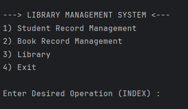
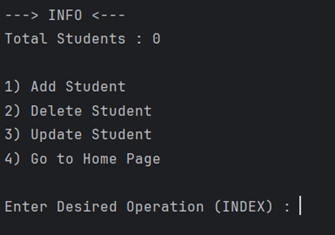
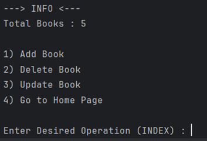
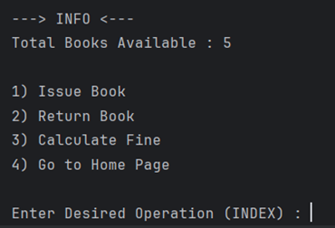

**LIBRARY MANAGEMENT SYSTEM**

--->  Developed a Java-based Library Management System with separate admin and student interfaces

--->  Implemented core features like book/student addition, deletion, updates, and fine calculation

---> Used Object-Oriented Programming with ArrayLists and HashMaps to manage data efficiently

